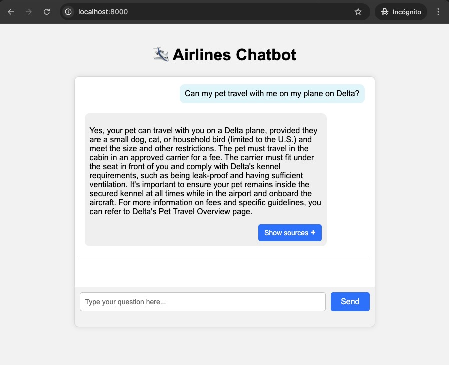

# LLM Airline Policy App

This is small chatbot application where a users can ask questions about the policies of different airlines. 

The application is based on a RAG (Retrieval Aumented Generation) system. A vector database (Chroma) is used to store and retrieve document embeddings efficiently. When the user makes a query, relevant parts of the documents are retrieved, and an LLM is used for generating an answer using this context information.

Users can ask questions and get answers for queries like the following:

1. `Can my pet travel with me on the plane on Delta?`

2. `I have three kids 2, 8 and 10 years old and I am traveling with them on a United flight, what are the rules for children traveling?`

3. `What is the baggage policy for American Airlines?`

4. `My wife is 8 months pregnant, can she travel on a Delta flight?`

## Set up steps
### 1. Clone this repository.
All the commands in the set up guide must be launched from the project's root folder.

### 2. Install poetry on your computer if it is not installed yet.
*Refer to: <https://python-poetry.org/docs/#installation>

The recommended way to install Poetry is by using the official installer. This way, Poetry and its dependencies will be isolated from the rest of your system and will not depend on your virtual environments.

#### Install on Linux, MacOS and Windows (WSL)

```
curl -sSL https://install.python-poetry.org | python3 - (--version 1.7.1)
```

Then we must add Poetry to our PATH environment variable, in order to be able to use it from the command line. The default installation path is: ```$HOME/.local/bin```

#### Make sure poetry has been installed correctly:

```
poetry --version
```
### 3. Install project dependencies using poetry
```bash 
poetry install
```

### 4. Create .env file
In the root folder of the project, create a copy of the [.env.template](.env.template) file, and name it '.env'.

Make sure to replace the OPENAI_API_KEY variable with your actual OpenAI API Key.

```python
# API KEYs
OPENAI_API_KEY=<your_api_key_here>

# PATH TO PERSIST CHROMADB
CHROMA_PATH="./chromadb"

# EMBEDDINGS (if OpenAI)
EMBEDDINGS_PROVIDER="openai"
EMBEDDINGS_MODEL="text-embedding-3-large"

...
```

In this file, you can modify other settings related to the app, such as the LLM model, the embeddings model, the size of the chunks, etc.

### 5. Run the server
Launch the server application using uvicorn. There is a script in the root folder to do it directly:
```bash
poetry run python server.py
```
The server will be launched in the following url: http://localhost:8000/

### 6. Upload documents to the vector database
The way to upload new documents is to make a POST request to the following endpoint: http://localhost:8000/database/upload_documents

The body of the request must have this format:
```json
{
    "data_path": ["policies/AmericanAirlines", "policies/Delta", "policies/United"]
}
```

Where "data_path" is a list of files or directories (paths can be absolute or relative to the project root folder). 

<i>*In case of including directories, only the files contained in the first level of that folder will be loaded. Any subdirectories will not be considered.</i>

A [Postman template](RAG_AIRLINES_APP.postman_collection.json) is provided to easily access the different endpoints using Postman. Just import it and use the "upload_documents" endpoint to load the files.

If not using Postman, you can use 'curl' to make the following request to the endpoint:
```bash
curl -X POST http://localhost:8000/database/upload_documents \
-H "Content-Type: application/json" \
-d '{"data_path": ["policies/AmericanAirlines", "policies/Delta", "policies/United"]}'
```

To make sure the files have been indexed correctly, we can make a request to the "list_indexed items" endpoint with Postman, or by using curl:
```bash
curl -X GET http://localhost:8000/database/list_indexed_items \
-H "Content-Type: application/json"
```

### 7. Access the chatbot interface on your browser and make queries:
As long as the server is running, we can access the chatbot interface from the browser, on http://localhost:8000

This is what the user interface looks like:




## Description of the application

### List of libraries/technologies used
#### - Chroma (Vector Database)
Chroma has been selected as our vector database due to it being open-source and easy to set up and use. It is well integrated with LangChain and has advanced metadata filtering options. It is not as scalable as non open-source options (Pinecone, Weaviate...), but works great for this small project.
#### - FastAPI + Uvicorn (API logic and deployment)
A combination of FastAPI and an Uvicorn server have been used to deploy our app as a web application. 
We have created different API endpoints to handle the main app functionalities (making queries, uploading documents to the vector database, retrieving documents from the vector database...)
#### - HTML / JavaScript / CSS
Simple choice for the front end, since it is not the main point of this technical challenge. An HTML page containing the ChatBot UI is updated dynamically using JavaScript, and interacts with the "query" API endpoint, by sending queries, receiving responses from the server and displaying them in the chatbox.
#### - LangChain
LangChain has been chosen as the framework for interacting with LLMs and processing text, due the amount of tools it provides for integrating embeddings, LLM, document search, vector databases and document parsers.
#### - OpenAI embeddings and LLMs / Support for Huggingface
The code has been designed so that the user can decide which embedding and LLM model to use, by modifying the '.env' file. Models from both OpenAI and HuggingFace can be used.
These are the models set up as default:
* Embeddings: OpenAI's <i>'text-embedding-3-large'</i>, released on January 25, 2024. If we want to prioritize resource efficiency, <i>'text-embedding-3-small'</i> can be selected.
* LLM: OpenAI's <i>'gpt-4o'</i> has been chosen as default, but <i>'gpt-4o-mini'</i> can be used for resource efficiency.

### How the RAG system works
The designed RAG works by following these steps:
#### 1. Reading the documents
The app can receive either files or whole folders as inputs.
For now, only <b>pdf</b> and <b>markdown</b> files are supported.
* <b>For reading PDF files:</b> we have used the library '<i>PyPDF</i>', as a simple first solution that can parse PDF text with decent results. This library does not work well with complex PDF structures, tables and images, so on of the future improvements should be dealing with these complex PDF structures.
* <b>For reading Markdown files:</b> we are just reading the raw text content of the file. This way, we make sure to preserve the header structure of the document and use it for splitting the documents taking advantage of this structure.
#### 2. Splitting the documents into chunks
Once the documents are parsed, they must be split into smaller chunks so that vector search can be more efficient.
Each type of document gets splitted following a different strategy:
* <b>For splitting PDF files:</b> we are using a custom splitter based on LangChain's <i>RecursiveCharacterTextSplitter</i>. This chunking method is based on dividing the text hierarchically and iteratively, by using a set of separators (e.g: '\\n\\n', '\\n', ' '...). That way, the semantic integrity of most chunks is preserved, since it tries not to split text in the middle of a paragraph. The chunk_size and chunk_overlap parameters can be set in the '.env' file. Potential improvements could be made here, by using Semantic or Hierarchical chunking.
* <b>For reading Markdown files:</b> we are using a custom splitter based on LangChain's <i>MarkdownHeaderTextSplitter</i>. This chunking method takes advantage of the structure of the markdown file and splits the text by using specific headers (e.g., #, ##, ###). Then, we add the whole "tree" of headers at the beginning of each chunk, so that we know which section and sub-section it belongs to.

#### 3. Indexing the chunks in the Vector Database (Chroma)
Once the chunks are ready, they get converted into embeddings and assigned unique IDs. Then, the embeddings get indexed in our Chroma database, which is persisted in a local directory (it can be set up in the '.env' file).

In order to improve retrieval, some <b>metadata</b> has been added to each chunk:
* source: the path to the original file
* airline (parent_folder): the specific airline each document belongs to (AmericanAirlines, Delta, United). It gets extracted automatically from the parent folder name containing the file. This information is later used for creating filters when performing vector search.
#### 4. Asking queries and generating answers
When the user makes a query, the following steps are followed:

* <b>Filtering:</b> detect whether any specific airline(s) are mentioned in the user query, and set up filters for retrieving only chunks belonging to these airlines. This enhances the precision of the RAG system. For now, simple keyword detection is used, but some improvements could include using NER, Fuzzy Matching, a pre-trained BERT model or another LLM to recognise which airline the query refers to.
* <b>Similarity search on vector db:</b> top K most relevant chunks are retrieved (default k=5), by using cosine similarity between embeddings.
* <b>Chat Memory</b>: along with the chunk's context, the memory of the previous conversation is also extracted, so that the user can ask follow-up questions to the chatbot.
* <b>Creating prompt</b>: a prompt gets created, including the context from the retrieved documents, the previous chat history and the user question.
* <b>Generating answer with an LLM</b>: the generated prompt is sent to an LLM (<i>gpt-4o</i> by default), which generates the answer with the given context.
* <b>Returning answer and list of sources</b> via the API response, so that the front-end can process this information and display it to the user.

## Some challenges faced
#### - Asking a question about a specific airline (e.g. United) but retrieving document chunks from another airline (e.g. Delta). 
This happened very often, and lead to hallucinations and wrong answers. I decided to implement some basic keyword detection on the user query, so that, if the question refers to a specific airline, only documents belonging to that airline will be queried, by using metadata filtering.
#### - Documents getting split at random points, and not respecting the document structure
I started using some simple fixed size chunking, which lead to missing or incomplete information in some of the chunks. Instead, I decided to implement custom splitters that take advantage of the text structure. I used recursive splitting for PDFs, using separators such as new lines. I used a specific splitter for markdown that takes into account the structure of the different headers (#, ##, ###), and thus preserves the chunks integrity.
#### - Chatbot not remembering previous interactions
It makes it unnatural for the user to ask follow-up questions that the chatbot cannot reply. I implemented a simple Chat Memory system that stores the previous question-answer pairs and adds them to the final prompt. This way, the chatbot can follow a more natural conversation.


## Future improvements
#### - Parsing PDFs 
The implemented solution is very simple (PyPDF) and does not work well with complex pdf structures. 

Some improvements I would like to implement include:
* <b>Using more advanced parsers</b>. For example, <i>Llamaparse</i>, which converts complex pdf docs into markdown. Other alternatives: <i>PyMuPDF</i>, <i>marker-pdf</i>, <i>Unstructured</i>.
* <b>Table extraction</b>: the solution I would like to implement involves extracting tables from the PDF files using the <i>pdfplumber</i> library, generating a text description of the tables using an LLM, and indexing these descriptions as chunks in the vector database. If these chunks are retrieved, they get replaced by the corresponding table so that the LLM can use it to reply the question.
* <b>Dealing with images</b>: we can extract the images from the document using libraries such as unstructured or pymupdf, and generate a description using a model such as GPT-4-vision. Then, these descriptions can be indexed as chunks.
#### - Splitting PDFs into chunks: 
The chunking strategy implemented for markdown files works quite well, but the one for PDFs (recursive splitting) is not optimal. Some alternatives I would like to try are:
* <b>Semantic chunking</b>: to split text based on the similarity of the embeddings of consecutive phrases. This way, we can make sure each chunk is a "semantic unit" and they are not split in the middle of an important idea.
* <b>Hierarchical chunking</b>: it can be a good idea to index smaller child chunks, and replacing them by bigger parent chunks after retrieval. This way, we leverage the advantages of searching small chunks (more granularity) and providing bigger chunks to the LLM (more context).

#### - Filtering by airline:
For now, the way to detect which airline the user query refers to is a very simple keyword detection algorithm. This is not optimal, since it depends on the user mentioning explicitly the name of the airline without any grammatical errors, abbreviations, etc.
It is also subject to errors if the user types words that coincide with the name of an airline (eg. 'united').

As a better alternative, we could use Name Entity Recognition, a pre-trained BERT model, fuzzy matching or a simple LLM in order to detect which airline the question refers to.

